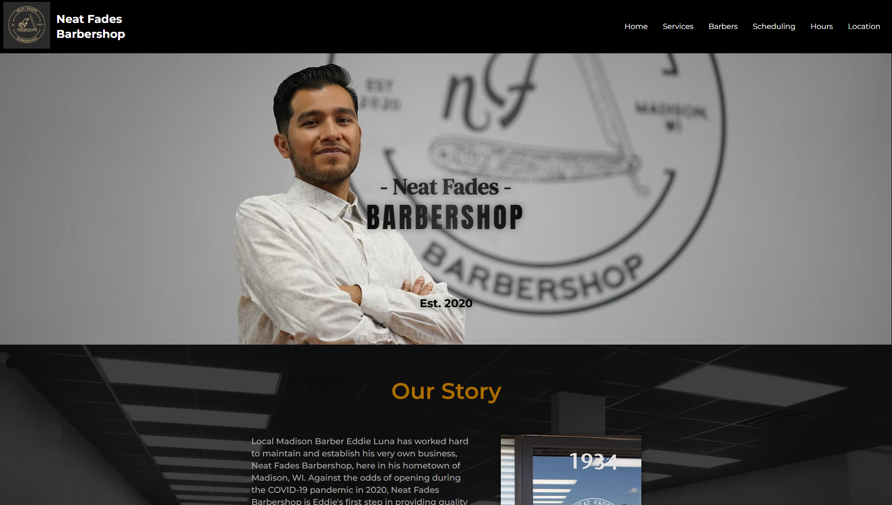
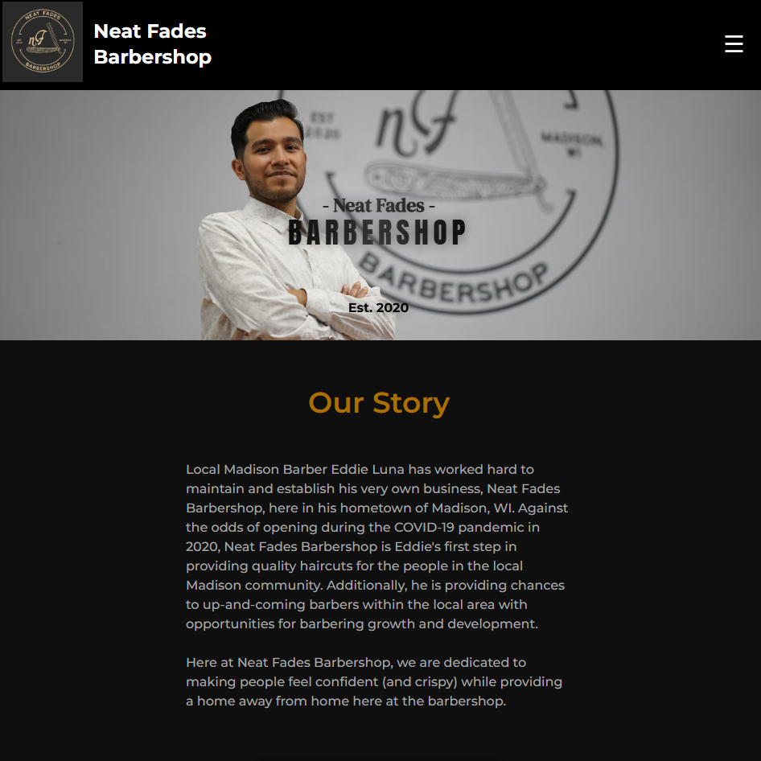
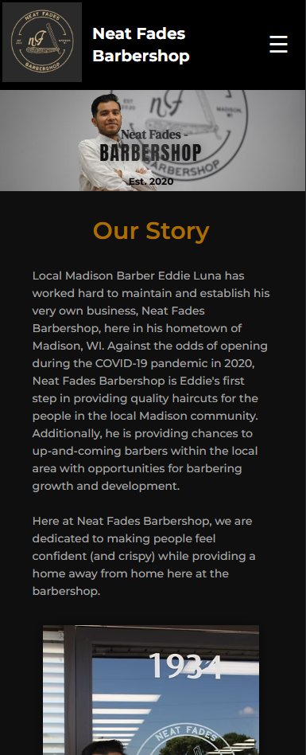

# Neat Fades Barbershop:

One of my first projects, based on a real barbershop located in Madison, WI for one of my cousins! It is in the style of a modern, dynamic website.

Including details about services, ameneties, store hours, location, barbers as well as scheduling linked to the real-world location!

## Project Structure:

### HTML:
- `index.html`: The main file of the project that contains the user interface and markup.
- `services.html`: Provides avaiable services as well as their corresponding prices.
- `barb-sche.html`: Shows some of the mosst profesional barbers available, as well as some of their work on customers and a button to schedule an appointment!
- `hrs-loc.html`: Displays store hours, contact (phone number and email), business location, as well as a Google Maps iFrame.

### CSS:
- `style.css`: All of the significant styles are located here! Including the font imported, CSS variables (including colors and font sizes), as well as many common classes used throughout the project!
### Other CSS documents (All style their corresponding HTML section!):
- `header.css`
- `hero.css`
- `story.css`
- `gallery.css`
- `info.css`
- `contact.css`
- `footer.css`
- `mobile-nav.css`: Mobile navigation displayed if the media query requires it.
- `services.css`
- `barb-sche.css`
- `hrs-loc.css`

### JavaScript:
- `main.js`: Toggle for the mobile menu display.
- `animations.js`: Provides animations throughout the project, across all HTML documents when loaded.

## Functionality

- Desktop and mobile menu.
- Links to GitHub, send an Email and LinkedIn.
- The website is fully responsive and adapts to different screen sizes!

## Responsiveness: 

### iPad:

### iPhone / Mobile Devices:

